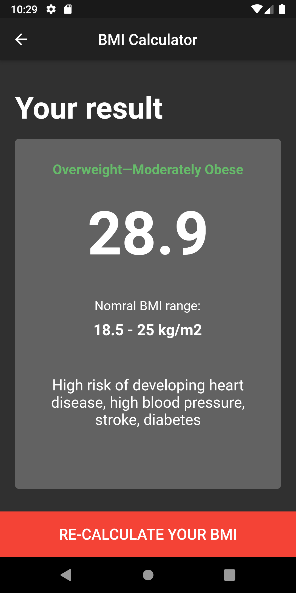

# BMI Calculator

## A beautiful flutter material app to calculate BMI

### Design idea credit: https://dribbble.com/shots/4585382-Simple-BMI-Calculator

#### Description:
It takes gender, height, weight and age as inputs. Then calculates BMI and provide suggestions in case of under/over bmi range.

#### Screenshots:

  
  

